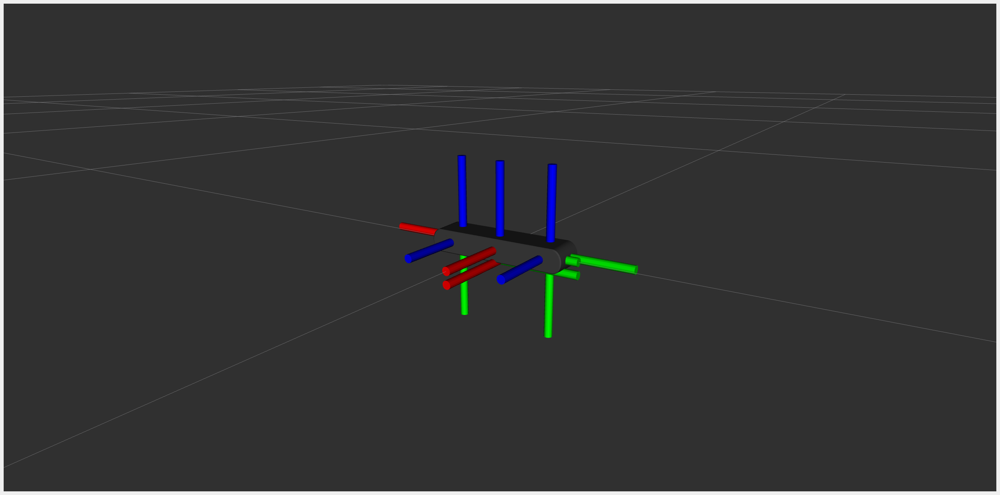

# What is this package for?

This is a simple ROS 2 description package to only feed in the **StereoLabs ZED 2i** model into the `robot_state_publisher`. The assets contained in the package are directly extracted from the official [zed-ros2-wrapper](https://github.com/stereolabs/zed-ros2-wrapper). 

# Getting started

## Dependencies

- Tested on **Ubuntu 22.04 LTS**
- Tested on **ROS 2 Humble**
- `robot_state_publisher`
- `joint_state_publisher`

# How to run

Once you clone this package:

```bash
cd <path/to/your>/ros2_ws/src

# If you can only access through HTTPS
git clone https://github.com/Megacephalo/zed2i_ros2_description.git
# or if you go with SSH
git clone   git@github.com:Megacephalo/zed2i_ros2_description.git
```

Build the package as

```bash
cd <path/to/your>/ros2_ws/
colcon build
# or specifically this pacakge
clone build --packages-select zed2i_ros2_description
source <path/to/your>/ros2_ws/install/setup.bash
```

Please replace the `<path/to/your>` with your actual directory path. By sourcing your workspace the ROS 2 file system can properly register your package and can be found as you go along this README.md.

Next, run the launch file:

```bash
ros2 launch zed2i_ros2_description zed_camera.launch.py
```

Then you should see the model loaded into Rviz2 as shown in the figure below.



# Contributors

- [Charly Huang](mailto:charly.charlongo@gmail.com)

# Acknowledgement

Huge shout out to the **StereoLabs** team for providing a well documented and comprehensive ROS2 package suite. The software documentation and availability are just terrific Thank you!